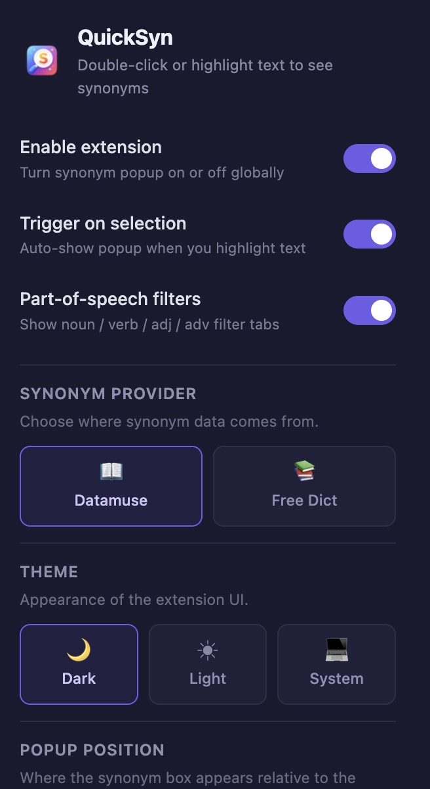
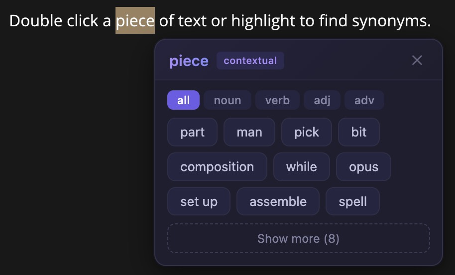

# QuickSyn

A fast, lightweight synonym finder that helps improve wording anywhere on the web.|

<table>
  <tr>
    <td></td>
    <td></td>
  </tr>
</table>

## What It Does

- Double-click or highlight text to fetch alternatives.
- Click a suggestion to replace text in-place.
- Filter by part of speech (noun, verb, adjective, adverb).
- Store local settings for per-site blocking, theme, and trigger behavior.

## Install (Development)

1. Clone the repository.
2. Open `chrome://extensions`.
3. Enable **Developer mode**.
4. Click **Load unpacked**.
5. Select this repository folder.

## Permissions

- `storage`: persist extension settings.
- `tabs`: read the active tab URL for "Block current site".

Focus on privacy and offline use, so no external API keys, tokens, or analytics are used.

## API

Synonyms come from [Datamuse API](https://www.datamuse.com/api/) and [Free Dictionary API](https://dictionaryapi.dev/):

`GET https://api.datamuse.com/words?rel_syn=WORD&max=40`

`GET https://api.dictionaryapi.dev/api/v2/entries/en/WORD`
